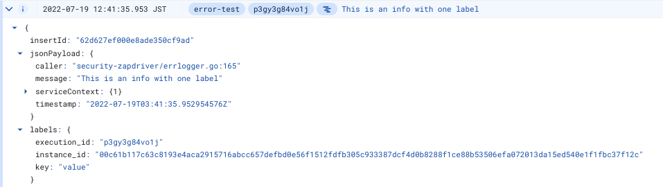

# :zap: Pazdriver

Zapdriver library modified for Mercari Security Team's (error) logging needs!

## Usage

### Initialization

If you use it in a Cloud Function or Cloud Run create a new logger like this:

```
import (
	pazdriver "github.com/mercari/pazdriver"
)

var logger *pazdriver.Logger

func init() {
	var err error
	logger, err = pazdriver.NewLoggerWithKServiceName()
	if err != nil {
		if logger != nil {
			logger.Error("Initializing new logger", err)
		} else {
			fmt.Printf("Initializing new logger: %v", err)
			os.Exit(1)
		}
}
```

This will init a Logger with serviceName set to `os.Getenv("K_SERVICE")`. If you are initializing it in an environment where `K_SERVICE` isn't available, or for some reason you want to use a different service name, you can use the following:

```
import (
	pazdriver "github.com/mercari/pazdriver"
)

var logger *pazdriver.Logger

func init() {
	var err error
	logger, err = pazdriver.NewLogger("my-service-name")
	if err != nil {
		if logger != nil {
			logger.Error("Initializing new logger", err)
		} else {
			fmt.Printf("Initializing new logger: %v", err)
			os.Exit(1)
		}
}
```
Make sure to not set the service name to an empty string, as it will cause an error and set the name to `unknown-service`. The logger will still be initialized and can be used.

### Logging

#### Info

You can use a static string, or a format string with the following syntax:
```
logger.Info("Info message")
variable := "message"
logger.Infof("Info with format string %s", variable)
```
#### Error

You can use a static string, or a format string with the following syntax:
```
logger.Error("Error message", err)
variable := "message"
logger.Errorf(err, "Error with format string %s", variable)
```

#### Fatal

You can use a static string, or a format string with the following syntax:
```
logger.Fatal("Fatal message", err)
variable := "message"
logger.Fatalf(err, "Fatal with format string %s", variable)
```

### Labeling and adding fields

If you want to add additional structured data, you have two choices: labels and fields.

#### Labels

Labels are strings that end up in the `labels` field, that can be seen in Cloud Log / Log Explorer like this:



Please note that the labels and fields are not visible in the Cloud Funcion / Cloud Run "Logs" tab, only the message:


You can add labels using the following functions:
```
logger.WithLabel("key", "value").Info("This is an info with one label")
logger.WithLabels(map[string]string{
  "x": "y",
  "z": "a",
  "b": "c",
}).Info("This is an info with multiple labels")
```

#### Fields

Fields require a string key and a Field type value and end up in the `jsonPayload` field. Make sure not to use keys that are already have a value by default, so don't use `caller`, `context`, `error`, `message`, `serviceContext`, `stacktrace` or `timestamp`, these fields won't get updated.
A Field can be anything that can be handled by [zap.Any()](https://pkg.go.dev/go.uber.org/zap#Any).


You can add fields using the following functions:
```
_, err := strconv.Atoi("-42e")
logger.WithField("key", "value").Info("Some text")
logger.WithFields(map[string]pazdriver.Field{
    "x": 42,
    "z": "a",
    "b": err,
}).Error("Some text", err)
```
### Error Reporting

The error logs will look like this in the GCP Error Reporting / Error Groups page:


You can see that they are grouped by the message. This grouping is not done by exact match, if only one word differs, they are likely to end up in the same group. You can read more about grouping [here](https://cloud.google.com/error-reporting/docs/grouping-errors). The serviceName is `error-test` in this example.

If you click on them, you get to the "Error Group Details" page.


If you click on the Recent samples / View logs, you get to the "Logs Explorer" page where you can see the raw log:


The location of the error is in the `jsonPayload.context.reportLocation` field, the error message is in the `jsonPayload.error` field, and the stacktrace is in the `jsonPayload.stacktrace` field.

You can also check the logs in the "Logs" tab of a Cloud Function / Cloud Run, but it only shows the message:


The same logs look like this in the Log Explorer, you can click on the red Error Reporting icon and to see the error in Error Reporting.


Below is the original readme:

# :zap: Zapdriver

Blazing fast, [Zap][zap]-based [Stackdriver][stackdriver] logging.

[zap]: https://github.com/uber-go/zap
[stackdriver]: https://cloud.google.com/stackdriver/

## Usage

This package provides three building blocks to support the full array of
structured logging capabilities of Stackdriver:

* [Special purpose logging fields](#special-purpose-logging-fields)
* [Pre-configured Stackdriver-optimized encoder](#pre-configured-stackdriver-optimized-encoder)
* [Custom Stackdriver Zap core](#custom-stackdriver-zap-core)
* [Using Error Reporting](#using-error-reporting)

The above components can be used separately, but to start, you can create a new
Zap logger with all of the above included:

```golang
logger, err := pazdriver.NewProduction() // with sampling
logger, err := pazdriver.NewDevelopment() // with `development` set to `true`
```

The above functions give back a pointer to a `zap.Logger` object, so you can use
[Zap][zap] like you've always done, except that it now logs in the proper
[Stackdriver][stackdriver] format.

You can also create a configuration struct, and build your logger from there:

```golang
config := pazdriver.NewProductionConfig()
config := pazdriver.NewDevelopmentConfig()
```

Or, get the pazdriver encoder, and build your own configuration struct from
that:

```golang
encoder := pazdriver.NewProductionEncoderConfig()
encoder := pazdriver.NewDevelopmentEncoderConfig()
```

Read on to learn more about the available Stackdriver-specific log fields, and
how to use the above-mentioned components.

### Special purpose logging fields

You can use the following fields to add extra information to your log entries.
These fields are parsed by Stackdriver to make it easier to query your logs or
to use the log details in the Stackdriver monitoring interface.

* [`HTTP`](#http)
* [`Label`](#label)
* [`SourceLocation`](#sourcelocation)
* [`Operation`](#operation)
* [`TraceContext`](#tracecontext)

#### HTTP

You can log HTTP request/response cycles using the following field:

```golang
HTTP(req *HTTPPayload) zap.Field
```

You can either manually build the request payload:

```golang
req := &HTTPPayload{
  RequestMethod: "GET",
  RequestURL: "/",
  Status: 200,
}
```

Or, you can auto generate the struct, based on the available request and
response objects:

```golang
NewHTTP(req *http.Request, res *http.Response) *HTTPPayload
```

You are free to pass in `nil` for either the request or response object, if one
of them is unavailable to you at the point of logging. Any field depending on
one or the other will be omitted if `nil` is passed in.

Note that there are some fields that are not populated by either the request or
response object, and need to be set manually:

* `ServerIP string`
* `Latency string`
* `CacheLookup bool`
* `CacheHit bool`
* `CacheValidatedWithOriginServer bool`
* `CacheFillBytes string`

If you have no need for those fields, the quickest way to get started is like
so:

```golang
logger.Info("Request Received.", pazdriver.HTTP(pazdriver.NewHTTP(req, res)))
```

#### Label

You can add a "label" to your payload as follows:

```golang
Label(key, value string) zap.Field
```

Note that underwater, this sets the key to `labels.<key>`. You need to be using
the `pazdriver.Core` core for this to be converted to the proper format for
Stackdriver to recognize the labels.

See "Custom Stackdriver Zap core" for more details.

If you have a reason not to use the provided Core, you can still wrap labels in
the right `labels` namespace by using the available function:

```golang
Labels(fields ...zap.Field) zap.Field
```

Like so:

```golang
logger.Info(
  "Did something.",
  pazdriver.Labels(
    pazdriver.Label("hello", "world"),
    pazdriver.Label("hi", "universe"),
  ),
)
```

Again, wrapping the `Label` calls in `Labels` is not required if you use the
supplied Zap Core.

#### SourceLocation

You can add a source code location to your log lines to be picked up by
Stackdriver.

Note that you can set this manually, or use `pazdriver.Core` to automatically
add this. If you set it manually, _and_ use `pazdriver.Core`, the manual call
stack will be preserved over the automated one.

```golang
SourceLocation(pc uintptr, file string, line int, ok bool) zap.Field
```

Note that the function signature equals that of the return values of
`runtime.Caller()`. This allows you to catch the stack frame at one location,
while logging it at a different location, like so:

```golang
pc, file, line, ok := runtime.Caller(0)

// do other stuff...

logger.Error("Something happened!", pazdriver.SourceLocation(pc, file, line, ok))
```

If you use `pazdriver.Core`, the above use-case is the only use-case where you
would want to manually set the source location. In all other situations, you can
simply omit this field, and it will be added automatically, using the stack
frame at the location where the log line is triggered.

If you don't use `pazdriver.Core`, and still want to add the source location at
the frame of the triggered log line, you'd do it like this:

```golang
logger.Error("Something happened!", pazdriver.SourceLocation(runtime.Caller(0)))
```

#### Operation

The `Operation` log field allows you to group log lines into a single
"operation" performed by the application:

```golang
Operation(id, producer string, first, last bool) zap.Field
```

For a pair of logs that belong to the same operation, you should use the same
`id` between them. The `producer` is an arbitrary identifier that should be
globally unique amongst all the logs of all your applications (meaning it should
probably be the unique name of the current application). You should set `first`
to true for the first log in the operation, and `last` to true for the final log
of the operation.

```golang
logger.Info("Started.", pazdriver.Operation("3g4d3g", "my-app", true, false))
logger.Debug("Progressing.", pazdriver.Operation("3g4d3g", "my-app", false, false))
logger.Info("Done.", pazdriver.Operation("3g4d3g", "my-app", false, true))
```

Instead of defining the "start" and "end" booleans, you can also use these three
convenience functions:

```golang
OperationStart(id, producer string) zap.Field
OperationCont(id, producer string) zap.Field
OperationEnd(id, producer string) zap.Field
```

#### TraceContext

You can add trace context information to your log lines to be picked up by
Stackdriver.

```golang
TraceContext(trace string, spanId string, sampled bool, projectName string) []zap.Field
```

Like so:

```golang
logger.Error("Something happened!", pazdriver.TraceContext("105445aa7843bc8bf206b120001000", "0", true, "my-project-name")...)
```

### Pre-configured Stackdriver-optimized encoder

The Stackdriver encoder maps all Zap log levels to the appropriate
[Stackdriver-supported levels][levels]:

> DEBUG     (100) Debug or trace information.
>
> INFO      (200) Routine information, such as ongoing status or performance.
>
> WARNING   (400) Warning events might cause problems.
>
> ERROR     (500) Error events are likely to cause problems.
>
> CRITICAL  (600) Critical events cause more severe problems or outages.
>
> ALERT     (700) A person must take an action immediately.
>
> EMERGENCY (800) One or more systems are unusable.

[levels]: https://cloud.google.com/logging/docs/reference/v2/rest/v2/LogEntry#LogSeverity

It also sets some of the default keys to use [the right names][names], such as
`timestamp`, `severity`, and `message`.

[names]: https://cloud.google.com/logging/docs/reference/v2/rest/v2/LogEntry

You can use this encoder if you want to build your Zap logger configuration
manually:

```golang
pazdriver.NewProductionEncoderConfig()
```

For parity-sake, there's also `pazdriver.NewDevelopmentEncoderConfig()`, but it
returns the exact same encoder right now.

### Custom Stackdriver Zap core

A custom Zap core is included in this package to support some special use-cases.

First of all, if you use `pazdriver.NewProduction()` (or `NewDevelopment`) , you
already have this core enabled, so everything _just works_ ™.

There are two use-cases which require this core:

1. If you use `pazdriver.Label("hello", "world")`, it will initially end up in
   your log with the key `labels.hello` and value `world`. Now if you have two
   labels, you could also have `labels.hi` with value `universe`. This works as-
   is, but for this to be correctly parsed by Stackdriver as true "labels", you
   need to use the pazdriver core, so that both of these fields get rewritten,
   to use the namespace `labels`, and use the keys `hello` and `hi` within that
   namespace. This is done automatically.

2. If you don't want to use `pazdriver.SourceLocation()` on every log call, you
   can use this core for the source location to be automatically added to
   each log entry.

When building a logger, you can inject the pazdriver core as follows:

```golang
config := &zap.Config{}
logger, err := config.Build(pazdriver.WrapCore())
```

### Using Error Reporting

To report errors using StackDriver's Error Reporting tool, a log line needs to follow a separate log format described in the [Error Reporting][errorreporting] documentation.

[errorreporting]: https://cloud.google.com/error-reporting/docs/formatting-error-messages

The simplest way to do this is by using `NewProductionWithCore`:

```golang
logger, err := pazdriver.NewProductionWithCore(pazdriver.WrapCore(
  pazdriver.ReportAllErrors(true),
  pazdriver.ServiceName("my service"),
))
```

For parity-sake, there's also `pazdriver.NewDevelopmentWithCore()`

If you are building a custom logger, you can use `WrapCore()` to configure the driver core:

```golang
config := &zap.Config{}
logger, err := config.Build(pazdriver.WrapCore(
  pazdriver.ReportAllErrors(true),
  pazdriver.ServiceName("my service"),
))
```

Configuring this way, every error log entry will be reported to Stackdriver's Error Reporting tool.

#### Reporting errors manually

If you do not want every error to be reported, you can attach `ErrorReport()` to log call manually:

```golang
logger.Error("An error to be reported!", pazdriver.ErrorReport(runtime.Caller(0)))
// Or get Caller details
pc, file, line, ok := runtime.Caller(0)
// do other stuff... and log elsewhere
logger.Error("Another error to be reported!", pazdriver.ErrorReport(pc, file, line, ok))
```

Please keep in mind that ErrorReport needs a ServiceContext attached to the log
entry. If you did not configure this using `WrapCore`, error reports will
get attached using service name as `unknown`. To prevent this from happeneing,
either configure your core or attach service context before (or when) using
the logger:

```golang
logger.Error(
  "An error to be reported!",
  pazdriver.ErrorReport(runtime.Caller(0)),
  pazdriver.ServiceContext("my service"),
)

// Or permanently attach it to your logger
logger = logger.With(pazdriver.ServiceContext("my service"))
// and then use it
logger.Error("An error to be reported!", pazdriver.ErrorReport(runtime.Caller(0)))
```
